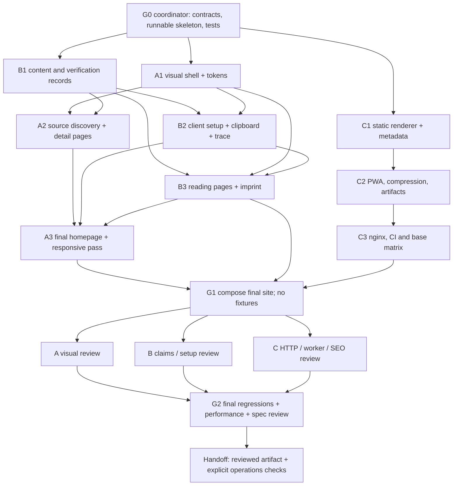

# GeneFoundry Modernization Implementation Plan

> **For agentic workers:** REQUIRED SUB-SKILL: Use superpowers:subagent-driven-development (recommended) or superpowers:executing-plans to implement this plan task-by-task. Steps use checkbox (`- [ ]`) syntax for tracking.

**Goal:** Deliver the approved scientific-registry design, accurate source/client content, accessible interactions and statically delivered SEO pages.

**Architecture:** A coordinator freezes contracts and integration points; three workers own interface/discovery, content/onboarding and static delivery. Vue produces static HTML at build time, hydrates enhancements and navigates with ordinary links.

**Tech Stack:** Existing Vue 3, TypeScript, Tailwind 4, Vite 7, VitePWA; Vue server-renderer; Node zlib; Vitest, Playwright and axe for verification.

**Spec:** [Design](../specs/2026-09-05-genefoundry-design.md), [contracts](../specs/2026-09-05-genefoundry-contracts.md), [copy](../specs/2026-09-05-genefoundry-copy.md), [surface contract](../specs/2026-09-05-genefoundry-surface.md).

## Global Constraints

- Preserve Vue 3, TypeScript, Tailwind 4 and Vite; no runtime server or framework/router migration.
- Use warm light reading surfaces, dark code panels, Archivo 600 display, existing Inter body and the GeneFoundry mark.
- No fabricated biomedical output, live status, citation, affiliation, privacy promise or tested-client claim.
- Preserve the absolute hosted endpoint `https://genefoundry.org/mcp`; never prepend the website base to backend URLs.
- Support website bases `/` and `/genefoundry/`; production canonicals use `https://genefoundry.org`.
- Public routes use `/sources/`, `/connect/`, `/workflows/`, `/about/`, `/limitations/`, `/imprint/`; backend `/docs/` stays reserved.
- All public pages have useful static HTML; source filtering and copy are progressive enhancements.
- Target WCAG 2.2 AA, 320 px reflow, 200% text stress, reduced motion and 44 px primary controls.
- Only the coordinator edits shared contracts, package/lockfiles, application composition and test configuration.
- Worker checks are non-mutating and scoped; do not run repository-wide autofix/format concurrently.
- Generate PWA hashes after final HTML; add compression sidecars afterward without mutating originals.
- No deployment, merge or external publication is implied by the planning deliverable.

---

## Execution model and ownership

**Maximum useful concurrency here is three implementers plus coordinator**, matching four available agent slots. More labels do not make shared-file editing independent. Workers own both appearance and behavior of a component. Pure audits/research can overlap G0; component implementation waits for frozen interfaces.

| Owner       | Exclusive files / groups                                                                                                                                                                                                                                                                                       |
| ----------- | -------------------------------------------------------------------------------------------------------------------------------------------------------------------------------------------------------------------------------------------------------------------------------------------------------------- |
| Coordinator | package/lockfiles, tsconfig/test configs, `src/App.vue`, `src/data/contracts.ts`, `site.ts`, `pages.ts`, `src/lib/urls.ts`, `src/lib/validation.ts`, `scripts/test-e2e.mjs`, `tests/helpers/navigation.ts`, `tests/unit/contracts.test.ts`, `tests/unit/urls.test.ts`, integration ledger and final evidence   |
| A           | `src/style.css`, NavBar/HeroSection/FooterSection/ServerCatalog, new SourceList; HomePage/SourceIndexPage/SourceDetailPage; `src/lib/catalog.ts`; old TrustBar/FeatureGrid/CtaSection/SectionLabel cleanup; Archivo/font assets; `tests/unit/catalog.test.ts`, `tests/e2e/discovery.spec.ts`, `visual.spec.ts` |
| B           | `src/data/servers.ts`, clients/source-details/workflows/faq/copy records; ConnectSection/CommandCard/EvidenceTrace/FaqSection; clipboard composable/barrel; all other pages; old ConsoleDemo/HowItWorks/ImprintModal cleanup; content/onboarding/evidence tests; safe public content evidence                  |
| C           | vite config/index template/main/server entry/metadata helper; scripts/build/prerender/compress/validate; machine files/PWA/OG generation; Docker/nginx/CI; delivery/artifact/worker tests                                                                                                                      |

No agent edits another owner's file because “the change is small.” It sends a change request naming the needed interface, reason and affected consumers. Coordinator serializes approved contract amendments and publishes the new freeze revision. A controls category CSS; B applies the agreed semantic class mapping to data. C alone owns public machine files; A owns font assets only.

Each task is an independently reviewable deliverable, broken into short actions. Use meaningful behavior tests for changed functionality; do not add tests that merely assert CSS literals or mirror static copy line-for-line. Every implementation task ends with its own scoped checks and review packet. Keep commits scoped to the owning task; serialize Git index/commit operations through the coordinator in a shared checkout.

## Dependency graph and schedule



A1/B1/C1 run together. When a task waits on a real dependency, its freed slot can run independent content-reference checks, artifact test authoring or read-only reviews. Do not expand edit scope to keep an agent occupied. B2 and B3 can split into fresh agents if a slot is free after C work, but not while that would exceed root-plus-three. Per-task review can run in a newly freed slot while unrelated tasks continue; a worker cannot approve its own task.

Estimated planning size: G0 1–2 focused hours; A lane 5–8; B lane 6–10 including source verification; C lane 5–8; integration/review 2–4. These are effort estimates, not promised elapsed runtime. The likely critical path is B1 evidence/content → B2/B3 → A3 → integration. Client runtime access may remain unavailable; use the defined documentation-only state and disclose it rather than inventing a passing test.

## G0 — Runnable contract freeze

### Test runner/server contract

Coordinator owns `playwright.config.ts`, `scripts/test-e2e.mjs` and `tests/helpers/navigation.ts`. Default `TEST_PHASE=dev` starts only the dedicated Vite server; it never starts nonexistent artifact servers during G0. Select projects and webServer entries conditionally by phase:

| Phase / project        | Base URL                             | Test match                                          | Server                                                                            |
| ---------------------- | ------------------------------------ | --------------------------------------------------- | --------------------------------------------------------------------------------- |
| dev / dev              | `http://127.0.0.1:5175/`             | discovery, onboarding, evidence, visual             | Vite with explicit `VITE_BASE_URL=/`, strict port 5175                            |
| static / static-root   | `http://127.0.0.1:4176/`             | rendering, content-pages, artifacts, service-worker | `serve-static.mjs --dir .build/artifacts/root --base / --port 4176`               |
| static / static-mirror | `http://127.0.0.1:4177/genefoundry/` | same static specs                                   | `serve-static.mjs --dir .build/artifacts/mirror --base /genefoundry/ --port 4177` |
| http / nginx           | `http://127.0.0.1:4180/`             | http                                                | actual Brotli nginx container, managed by test-e2e.mjs                            |

All names refer to `tests/e2e/<name>.spec.ts`. Configure projects in separate phase branches; no project defaults silently to localhost dev. Tests for root and mirror use relative page paths through this helper:

```ts
export function pageUrl(baseURL: string | undefined, relativePath = ''): string {
  if (!baseURL || relativePath.startsWith('/'))
    throw new Error('Use an explicit base and relative page path')
  return new URL(relativePath, baseURL).href
}
// page.goto(pageUrl(baseURL, 'sources/gnomad/')) preserves /genefoundry/.
```

Leading-slash examples in dev-only A/B tests deliberately target the dev root; convert to pageUrl before reusing them in mirror projects. HTTP tests target root nginx and may use root paths. Each worker browser test uses isolated contexts, and worker tests use separate install/update profiles.

Scripts: `test:e2e=playwright test` (defaults to dev); `test:e2e:artifacts=TEST_PHASE=static playwright test`; `test:e2e:http=TEST_PHASE=http playwright test`; `test:e2e:all=node scripts/test-e2e.mjs`. The all-runner first validates retained artifact presence, runs dev/static phases, builds/starts one uniquely named test container for HTTP, and stops only its own container in finally. It does not rebuild or overwrite shared dist during tests. If Docker is unavailable, report that HTTP gate unexecuted; do not substitute Vite or claim full delivery validation. CI provides the required Docker service.

G0 also captures the old production artifact and service worker before app changes into `.build/baseline/` for C's update test. Build scripts must never delete that directory. In G1 retain final root/mirror outputs as specified below; final static tests begin only after all lane components are complete. A/B lane completion gates use dev and unit checks, preventing an integration dependency cycle.

**Files:** coordinator files above; create all page skeletons once, then transfer ownership. Add generated `.build/`, test output and browser cache paths to `.gitignore` if absent; keep planned specs and baseline evidence. Read the using-git-worktrees skill at execution time and use an isolated checkout that includes these currently uncommitted planning documents and audit baseline without losing user changes.

**Consumes:** all specifications, current exports and audit. **Produces:** compiling app with frozen props/records/helpers, runnable test harness and ownership ledger.

- [ ] Record `git status --short`, baseline revision and execution checkout path in `docs/superpowers/execution/2026-09-05-ledger.md`. Preserve unrelated changes. Do not restart the already running dev process merely because it belongs to an earlier turn.
- [ ] Install only coordinator-owned test dependencies, once. Registry metadata checked during planning: Vitest 5.0.0 supports Vite 7 and Node 22.12+/24+; Playwright 1.63.0 supports Node 20+; axe integration 4.13.0. Use Node 24 for execution/CI/container alignment. Verify install/lock resolution rather than upgrading production dependencies.

```bash
npm install --save-dev --save-exact vitest@5.0.0 @playwright/test@1.63.0 @axe-core/playwright@4.13.0
npx playwright install chromium
```

- [ ] Add scripts `lint:check=eslint .`, `test=vitest run`, `test:e2e=playwright test`; retain existing build until C replaces it. Tests need no jsdom: unit tests are data/pure helpers, browser tests exercise Vue. Configure Vitest in a separate `vitest.config.ts` with `plugins:[vue()]`, node environment, and `tests/unit/**/*.test.ts`; do not inherit PWA build plugins. Configure Playwright using the explicit project/server matrix below; no static or nginx test may silently run on Vite dev. Retain failure traces outside tracked source. Coordinator also ignores archived audit/research evidence and generated .build/dist/test-results in ESLint, without excluding application or maintained test source.
- [ ] Implement exact contracts from the companion spec. Create source/client/workflow data shells only as development fixtures, with correct discriminants and explicit fixture marker; B owns and removes them after freeze. Build PAGES from data and reject invalid records. Create all pages with their final props; no undocumented API promises.
- [ ] Implement URL helpers and routing tests first. Concrete minimum:

```ts
import { expect, test } from 'vitest'
import { siteHref, canonicalUrl, stripBase } from '../../src/lib/urls'
test('mirror links preserve path and anchor while canonical stays production', () => {
  expect(siteHref('/sources/gnomad/', '/genefoundry/')).toBe('/genefoundry/sources/gnomad/')
  expect(siteHref('/#connect', '/genefoundry/')).toBe('/genefoundry/#connect')
  expect(canonicalUrl('/sources/?q=hpo')).toBe('https://genefoundry.org/sources/')
  expect(stripBase('/genefoundry/connect/codex/', '/genefoundry/')).toBe('/connect/codex/')
  expect(() => siteHref('//example.org/', '/')).toThrow()
  expect(() => siteHref('/../mcp', '/')).toThrow()
})
```

Run `npm test -- tests/unit/urls.test.ts` to observe the missing/failing behavior, implement, then require pass. Test unknown path resolution explicitly returns undefined rather than home.

- [ ] Add contracts test: every server joins exactly one detail, each of six ClientIds has exactly one guide/page, two WorkflowIds match route pages, paths unique, and a copied verified guide with null recipeTest is rejected by validateContent. Build-only execution-ledger joins are additionally checked by C. Fixtures may bypass publication completeness only in dev; publication validation never bypasses them.
- [ ] Wire App to the final page dispatch and NavBar/FooterSection skeletons. Set SITE using one build year/base; page components are props-only, global state is not shared across SSR renders. Run `npm run type-check`, unit tests and a dev smoke screenshot.
- [ ] Freeze the file table, global token names, page names/props, record types, six client IDs, two workflow IDs and URL helper behavior. Announce G0 revision to A/B/C. Commit only G0 files after reviewing the index.

**Gate:** C can render all page kinds from skeletons; A/B can edit their pages without root/App changes. Fixtures visibly fail production validation and cannot accidentally ship.

## G1 — Integrate complete lanes

**Consumes:** A3/B3/C3 review packets. **Produces:** complete, reviewed route graph and two build artifacts.

- [ ] Confirm all worker commits contain only assigned paths. Review each task for specification coverage and implementation quality; return concrete defects to the same owner.
- [ ] Coordinator resolves App imports and page props, data joins, removed exports and aliases. Remove obsolete mounted sections, modal code and stale machine content; do not retain two visual systems to avoid a merge conflict.
- [ ] Run the complete contract/content test set and `npm run type-check`, then `npm run lint:check`. Do not claim correctness from a successful build alone.
- [ ] Build root and mirror sequentially into separate retained artifacts. Each invocation uses explicit base and then copies the validated dist to `.build/artifacts/root` or `.build/artifacts/mirror`; do not run two builds writing dist concurrently.
- [ ] Require no development fixtures, local evidence paths, direction contracts, stale 17/218 counts or unqualified demo values in public output. Verify all 36 current production routes plus 404; counts derive from records.
- [ ] Dispatch independent review wave: A visual/reflow/keyboard; B claims/recipes/evidence; C HTTP/PWA/base/SEO. Their checks may run on separate ports and profiles; expensive Lighthouse measurements wait until browser-heavy work settles.

## G2 — Final evidence and release handoff

- [ ] Run `npm test`, `npm run test:e2e:all`, `npm run type-check`, `npm run lint:check`, both-base artifact validation, container HTTP and service-worker tests. All intentional documentation-only recipe states remain explicitly visible; no incomplete implementation test is relabeled N/A.
- [ ] Capture homepage, sources, a source detail, connect, actual published guide states (verified only where real evidence exists), workflow, imprint and error page at representative widths. Automated matrix: 320/390/768/1440, reduced motion and 200% text; manual detailed visual review uses 390/768/1440. Capture only final content with fonts settled.
- [ ] Run Impeccable detector once on final affected markup/source and use browser evidence. Adjudicate duplicated font signals, unused utilities and transient animation states; do not treat detector counts as proof of authorship or quality.
- [ ] Give a fresh reviewer the design/copy/contracts, baseline and final screenshots, browser results, detector output and exact scope. It checks spec compliance and design quality independently. Apply one cohesive fix batch, recapture affected states and obtain a verdict; do not self-certify visible defects.
- [ ] Run Lighthouse production mobile/desktop sequentially. Target mobile ≥95, LCP ≤2.5 s, CLS ≤0.1, initial JS+CSS ≤100 kB gzip; report actual results and lab limits. Re-score original UX/SEO rubric without changing weights to make the score rise.
- [ ] Record built visual system in root DESIGN.md and update Impeccable surface/critique snapshot and CLAUDE.md architecture from final evidence. Preserve raster provenance for the logo/social image and any future images; research screenshots never become shipping page art.
- [ ] Summarize changed behavior, test evidence, actual scores, remaining documentation-only clients, source verification limits and edge-route ownership. Deliver a reviewable built artifact/branch; do not deploy as a hidden final step.

**Operations-dependent release checks:** inventory live edge ownership of MCP/OAuth/health routes; confirm one real client activation using authorized credentials and current supported version; verify public root/canonical/404 after an authorized deployment; use owner's Search Console and field metrics later. An unavailable credential does not prevent completing frontend work or justify claiming those checks passed.

## Coverage matrix

| Spec | Implementing tasks | Proof                                                         |
| ---- | ------------------ | ------------------------------------------------------------- |
| R01  | A1, A3             | Screenshot contract, tokens, font provenance, visual reviewer |
| R02  | B1, B2, A3         | Claims ledger, content tests, visible auth before copy        |
| R03  | B1, B2, B3         | Semantic illustration and both workflow records/pages         |
| R04  | A2, B1             | Search intersection/reset tests; 21 substantive source routes |
| R05  | B1, B2             | Six guides/statuses, copied data, denied/fallback/race tests  |
| R06  | A1–A3, B2–B3       | Keyboard, native controls, text/reflow/axe matrix             |
| R07  | C1, G1             | Complete no-JS pages, hydration console, both bases           |
| R08  | B1, C1–C2          | Unique heads, sitemap joins, FAQ/OG checks                    |
| R09  | C2–C3              | Container status/cache, decompression, worker tests           |
| R10  | All + G2           | Reproducible test artifacts and independent review            |
| R11  | G0–G2              | Ownership ledger, freeze, DAG and scoped reviews              |
| R12  | B1, B3, A1         | About/limitations/imprint routes, preserved legal text        |

## Dispatch packet

Give each fresh worker: its exact task text; design/contracts/copy files; baseline revision; own editable paths; consumed/produced interfaces; dependency status; relevant tests; the no-cross-owner rule. Ask for files changed, actual commands/results, evidence paths and remaining limitations. Workers use the same plan, not inherited assumptions from a long conversation.

Recommended execution is the requested parallel-agent workflow. Planning does not start implementation; when execution is requested, begin G0 and proceed through the dependency graph without repeatedly asking whether to continue.
